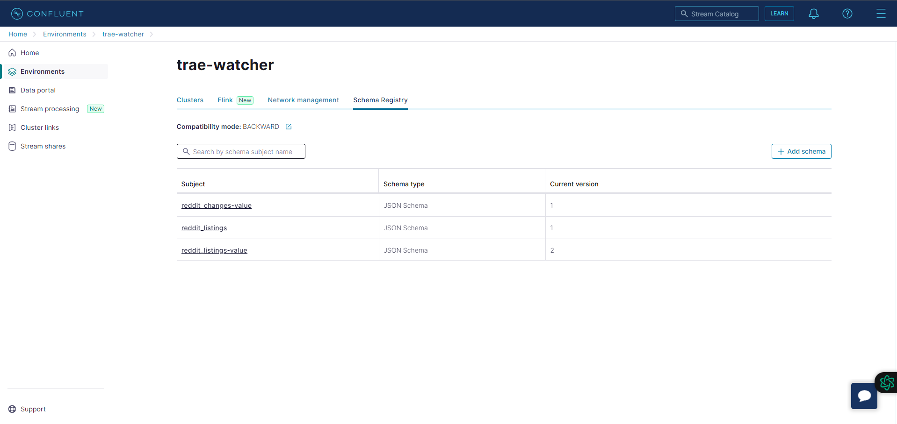

# trae-watcher
*As of 4/28/2024, the free trial for the Confluent Kafka account hosting this application has expired, meaning data is no longer being populated using this package.

The intention of this project is to create a data streaming application that over time, would store all reddit posts in the Atlanta Hawks [subreddit](https://www.reddit.com/r/AtlantaHawks/) relating to Trae Young. 

## [`watcher.py`](https://github.com/liamellison02/trae-watcher/blob/main/watcher.py)
This is the Python script scheduled to run daily in order to populate the ksqlDB schema `reddit_listings` stored in Confluent Kafka.

1. The script begins by configuring the connection to our cluster's schema registry which in turn allows us to make transactions with our selected schemas through our [producer configuration](https://github.com/liamellison02/trae-watcher/blob/main/watcher.py#L50).

2. After configuring these connections, we retrieve reddit listing data in JSON format which is returned by the query built in the [`get_url`](https://github.com/liamellison02/trae-watcher/blob/main/watcher.py#L19) function.

3. After receiving the response from the previous query, the JSON data is cleaned via the [`clean_data`](https://github.com/liamellison02/trae-watcher/blob/main/watcher.py#L32) function. The variable [`specific_keys`](https://github.com/liamellison02/trae-watcher/blob/main/watcher.py#L15) contains preset key identifiers that allows the function to parse the JSON data for the desired values. To understand more on the data being parsed, view a sample query [here](https://www.reddit.com/r/AtlantaHawks/search.json?q=trae+young&limit=100&t=month&sort=new&restrict_sr=on).

4. With the desired data stored in a list returned by the previous function, the script loops through the list entries, streaming the data through the producer config that was defined earlier.

## Kafka Setup

### Environment Config
The `trae-watcher` environment hosts a cluster titled `worker` and the schema registry containing the target schemas.

### Schema Registry
The schema registry shows our schemas:

1. `reddit_listings` - Listing data for all reddit posts in r/AtlantaHawks with a title containing Trae Young's name.
2. `reddit_listings-value` - Metadata pertaining to each entry that allows us to setup a persistent query to log changes for each entry into a table.
3. (Not shown) `reddit_changes` - A log of changes found in the data streamed to `reddit_listings`.
4. `reddit_changes-value` - Metadata stored by the persistent query describing the entries in the `reddit_changes` schema. 

### Cluster Config
The ksqlDB cluster houses the producer data streams and the persistent query that documents the changes found in listing data between stream versions.

